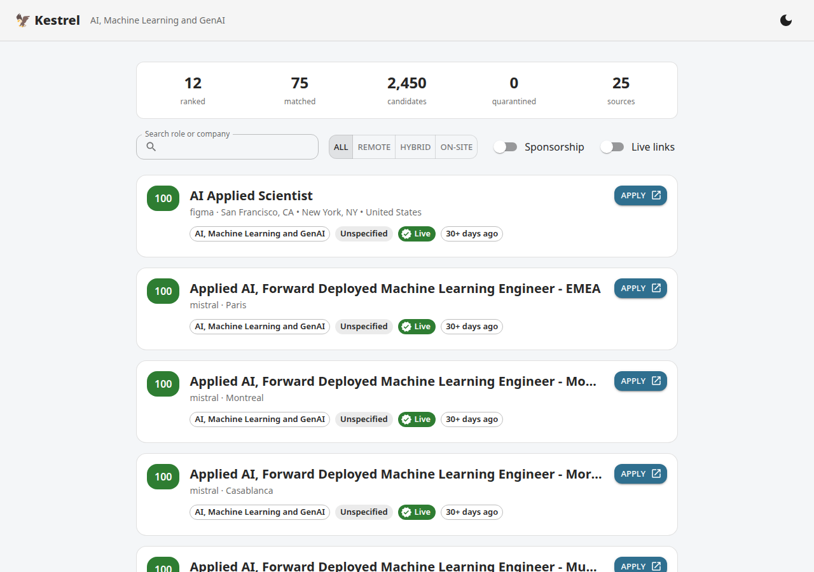
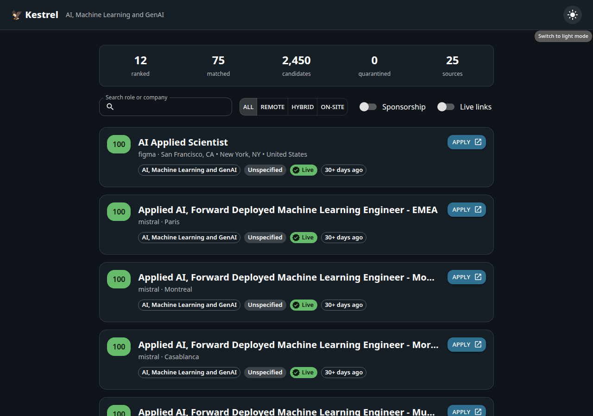
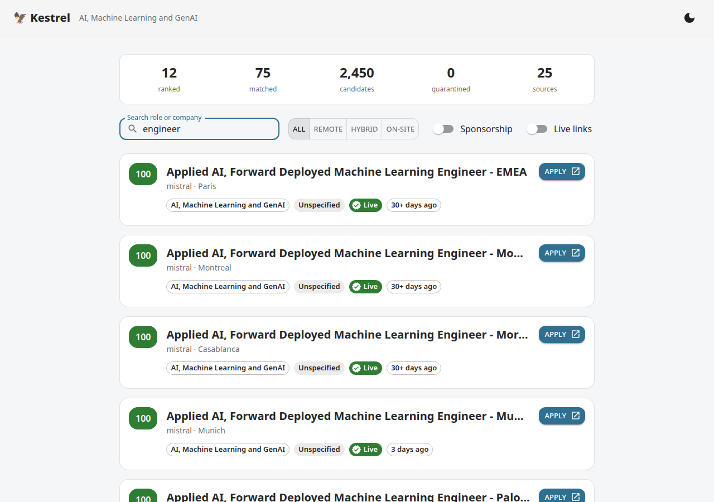
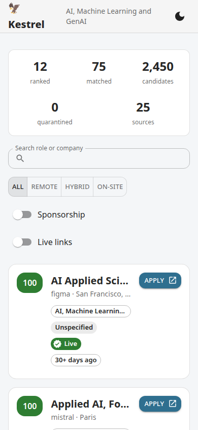

# Kestrel

> A kestrel hovers dead-still over a field, scanning the ground, then drops on the one target worth the dive. This engine does the same for jobs.

**Kestrel** is a multi-source job-discovery engine for IT roles. Give it a domain
(say _AI / Machine Learning_) and a country, and it expands that into hundreds of
real-world title variants, sweeps public ATS boards and job APIs, throws out senior
and management roles, verifies that each posting is still live, scores how
ready-to-apply each one is, ranks the strongest matches, and delivers a digest.

The logic lives as a pure, typed TypeScript library. The n8n workflow and the CLI
runner are thin adapters over that library — so every rule is unit-tested in isolation.

<!-- CI badges go live once the pipeline is pushed (M8). -->
<!--  -->

---

## Why it's interesting

✍️ TODO: my words — what I find genuinely interesting about this build.

## Status

The engine, CLI and web dashboard are built and tested (600+ unit tests, ~97% coverage)
and the CLI is verified against live APIs. Progress is tracked slice-by-slice in
[ROADMAP.md](./ROADMAP.md). Everything here is built and tested before it is described.

## Architecture (current engine)

Kestrel runs as a staged pipeline. Each stage is a pure function in `src/`:

| Stage | What it does |
| --- | --- |
| **Taxonomy** | Expands one of 20 IT domains into hundreds of role aliases + match terms. |
| **Scrape** | Concurrently queries public ATS boards (Greenhouse, Lever, Ashby), RemoteOK, and — when keys exist — Adzuna, Jooble, SerpAPI, ScrapeGraphAI. Retries with backoff; a dead source never stops the run. |
| **Filter & match** | Normalises titles, blocks senior/management roles, scores each job against the selected domain(s). |
| **Verify & enrich** | Confirms the job link is live, detects expired postings, derives company domain + public careers/contact links, computes an apply-readiness score. |
| **Rank** | Deterministic, explainable local scoring — no paid LLM. |
| **Deliver** | Builds a digest (Telegram today; a web dashboard is on the roadmap). |

> Full diagrams (architecture, data-flow, sequence, ER) land in [`docs/`](./docs) at M9.

## Getting started

```bash
nvm use            # Node 22
npm ci
npm test           # run the unit suite
npm run typecheck  # strict TypeScript, no emit
npm run lint       # ESLint
```

No credentials are required to develop or test: the keyless public boards
(Greenhouse / Lever / Ashby / RemoteOK) need no API keys, and external calls are
mocked in tests. Optional API-key sources are configured via `.env` (see
[`.env.example`](./.env.example)).

## How to run

```bash
# Scan live keyless public boards and print a ranked digest (no API keys needed):
npm run cli -- scan --domain ai --country IE --top 10

# JSON output (drives the dashboard):
npm run cli -- scan --domain ai --country IE --top 12 --json > web/public/scan.json

# Deterministic offline run from fixtures (dev/test):
npm run cli -- scan --domain ai --offline tests/fixtures/offline-scan.json
```

A real scan returns live, link-verified jobs — e.g. a recent run pulled **2,450
candidates → 75 matched → 12 ranked** across 25 sources.

### Web dashboard

```bash
cd web && npm ci && npm run dev   # then open the printed URL
```

The dashboard binds to `web/public/scan.json` (real engine output — no bundled data).

## How to test

```bash
npm test           # full suite
npm run test:cov   # with coverage thresholds
```

Tests are free, fast, and deterministic — every external boundary is mocked, and
cases are parametrised across all 20 domains and all source shapes.

## Screenshots

Captured from the web dashboard rendering a **real scan** (no staged data).

| Dashboard (light) | Dashboard (dark) |
| --- | --- |
|  |  |

| Search filter | Mobile (responsive) |
| --- | --- |
|  |  |

## License

[MIT](./LICENSE) © Gautham Binoy
