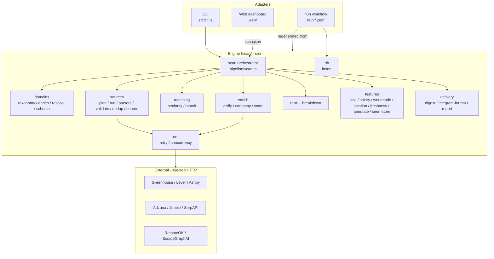
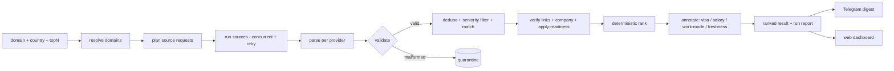
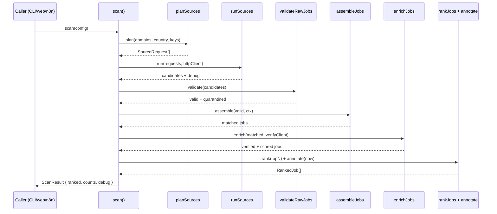

# Kestrel — Architecture

All diagrams are derived from the real code in `src/` and the `web/` dashboard.

## Component architecture

How the pieces connect: one typed engine library, three thin adapters over it.

## Data-flow diagram

How a request becomes a ranked digest.

## Scan sequence

The lifecycle of a single `scan()` call.

> No ER diagram: the engine library is stateless over injected HTTP. The only
> persistence is the optional cross-run seen-store (a flat JSON array of hashes)
> and, for the n8n adapter, the existing `jobs` table written via `db/insert.ts`.
